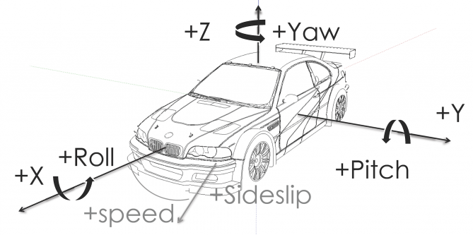
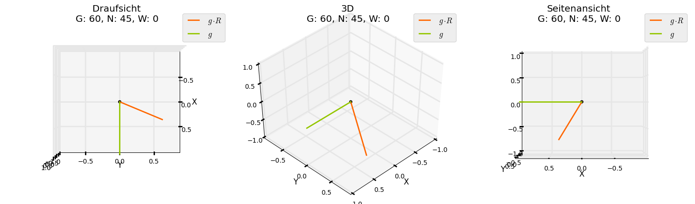

RotationMatrix
==============

Calculate ZYX Rotation Matrix DIN70000 and Quaternion

Rotation in 3D ist ein ziemlich kompliziertes Ding, weil man viele verschiedene Konventionen und Definitionen hat. Ließt man im Internet nach, steht auf jeder Seite etwas anderes, weil oftmals keine Definition dazu angegeben ist. Da die Roation mit den 3 Euler Winkeln nicht kommutativ ist, ist die Reihenfolge (Konvention) wichtig.

Hier wird nach der in der Automobilindustrie üblichen ZYX Konvention gedreht (d.h. erst gieren, dann nicken, dann wanken). Dazu gibt es noch die Rotation in Quaternionen-Beschreibung.

Klingt zuerst total kompliziert, ist es aber eigentlich gar nicht.

###[IPython Notebook](http://nbviewer.ipython.org/github/balzer82/RotationMatrix/blob/master/RotationMatrix.ipynb)

###[Vimeo Video](https://vimeo.com/100209309)